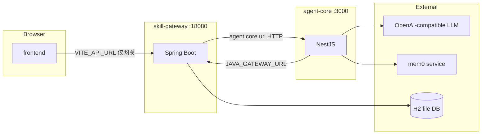

# 内网技术栈重构开发计划（frontend + skill-gateway，agent-core 黑盒）

本文档指导以当前 **`backend/agent-core` 为稳定内核**，使用公司内部技术栈重构 **`frontend`** 与 **`backend/skill-gateway`**，使系统更易运维、易扩展，并让两侧团队 **仅依赖 HTTP/SSE 契约** 集成 agent-core，无需阅读其内部实现。

**与 OpenSpec 变更 `internal-stack-refactor-plan` 的对齐**：该变更当前 **仅聚焦** 一件事——消除 **frontend 对 agent-core 的直连**，统一为 **frontend → skill-gateway → agent-core**（存量 `agentUrl` 改为经网关 BFF）。本文档其余章节（MySQL、公司脚手架、跨系统鉴权、任务持久化等）仍为 **整体演进参考**，不要求与该 OpenSpec 任务一并交付。

**关联工件：**

- API 契约草稿（建议作为 SSOT）：[`doc/internal-stack-api-draft.yaml`](./internal-stack-api-draft.yaml)
- OpenSpec 变更（proposal / design / specs / tasks）：`openspec/changes/internal-stack-refactor-plan/`
- 架构与部署参考：`docs/ARCHITECTURE.md`、`docs/single-host-deploy.md`

---

## skill-gateway 主要模块（现状与规划）

以下按 **`backend/skill-gateway`** 当前 Java 包结构归纳，便于内网栈重构时分工、拆分 Maven module 或对齐公司脚手架。

### 模块总览

```
com.lobsterai.skillgateway
├── controller/          # HTTP API 入口（浏览器与 agent-core 消费面）
├── service/             # 业务与集成逻辑
├── repository/          # Spring Data JPA
├── entity/              # 持久化模型
├── dto/                 # 请求/响应 DTO
├── config/              # Security、CORS 等
├── orchestration/       # 对 agent-core 的编排（任务 SSE）
├── aspect/              # 横切（审计等）
└── SkillGatewayApplication.java
```

### 各层职责（现状）

| 模块 | 主要类 / 范围 | 职责摘要 |
|------|----------------|----------|
| **controller** | `AuthController`、`UserController`、`TaskController`、`SkillController`、`ServerLedgerController`、`HealthController` | 注册/登录、用户资料与 LLM 设置、对话任务与 SSE、Skill CRUD 与内置 skill 执行入口、服务器台账、健康检查 |
| **service** | `UserService`、`SkillService`、`ServerLedgerService`、`ApiProxyService`、`SSHExecutorService`、`LinuxScriptExecutionService`、`LinuxScriptServerRegistryService`、`SecurityFilterService` | 业务规则、对 agent-core 的 HTTP 代理（头像、记忆）、SSH/脚本执行与服务器注册表解析 |
| **repository** | `UserRepository`、`SkillRepository`、`ServerLedgerRepository`、`AuditLogRepository` | 数据访问 |
| **entity** | `User`、`Skill`、`ServerLedger`、`AuditLog` | JPA 实体 |
| **dto** | 如 `LlmSettingsResponse`、`LlmSettingsUpdateRequest` | API 契约与校验载体 |
| **config** | `SecurityConfig` | CORS；`/api/skills/**` 写操作需 **`X-Agent-Token`**（与 `JAVA_GATEWAY_TOKEN` 对齐）认证为 `ROLE_AGENT`；其余路径当前多为放行 |
| **orchestration** | `TaskDispatcherService`、`AgentStreamConsumer` | 将任务转发到 `agent.core.url` 的 `POST /agent/run` 并消费 SSE |
| **aspect** | `AuditAspect` | 与审计日志相关的切面逻辑 |

### 后续规划：**跨系统用户鉴权模块**

目标：在保留 agent-core **机器间**调用（`X-Agent-Token`）的前提下，为 **浏览器 / 其他业务系统用户** 提供与公司统一身份体系一致的鉴权，避免长期依赖「仅用户 ID + 本地注册表」的弱模型。

建议作为独立边界实现（物理上可为同应用内新包 `…auth` / `…identity`，或未来拆成 starter）：

| 子能力 | 说明 |
|--------|------|
| **Token 校验** | 校验 OAuth2/OIDC **Access Token**（JWT 签名或 **introspection**），或对接公司统一 **SSO** 回调与会话 |
| **主体映射** | 将 IdP `sub` / 工号 / 租户内 ID **映射**到本库 `User`（或扩展「外部主体 ID」字段），支持首次登录自动建用户或管理员预绑定 |
| **与现有 API 衔接** | 将「当前用户」注入 `SecurityContext`；`X-User-Id` 等 header 逐步改为 **仅服务端从 Token 推导**，减少前端伪造风险 |
| **与 Agent 链路** | 任务创建 / SSE 上下文中的 `userId` 与 LLM 设置加载 **以鉴权结果为准**，与 `UserService` 现有逻辑对齐 |
| **双轨与迁移** | 可定义过渡期：保留 `POST /api/auth/login`（六位 ID）与 SSO 并存，通过配置开关切换；文档明确下线条件 |

**非本模块职责（避免膨胀）**：agent-core 调用的 **`X-Agent-Token`** 仍表示「受信任的 agent 实例」，与用户 OAuth 分离；LLM Key 加密、台账业务规则等仍在各自 **service** 中。

---

## 1. 当前全量交互与外部依赖

### 1.1 服务角色与数据流（简图）



### 1.2 frontend → skill-gateway（`VITE_API_URL`，默认 `http://localhost:18080`）

| 用途 | 方法 | 路径 | 说明 |
|------|------|------|------|
| 登录 | POST | `/api/auth/login` | `useUser.ts` |
| 注册 | POST | `/api/auth/register` | `useUser.ts` |
| 用户信息 | GET | `/api/user/{id}` | `useUser.ts` |
| 更新头像 | PUT | `/api/user/{id}/avatar` | `useUser.ts` |
| LLM 设置读/写 | GET/PUT | `/api/user/{id}/llm-settings` | `useUser.ts` |
| AI 生成头像（网关合并 LLM 后转发 agent） | POST | `/api/user/{id}/avatar/generate` | `RegisterView.vue` |
| 创建对话任务 | POST | `/api/tasks` | `services/api.ts` |
| 任务 SSE | GET | `/api/tasks/{id}/events` | `EventSource`，见 `getEventSourceUrl` |
| Skill 列表（读） | GET | `/api/skills` | `useSkillHub.ts` |
| 服务器台账 CRUD | GET/POST/PUT/DELETE | `/api/server-ledgers`… | `useServerLedger.ts`，需 `X-User-Id` |

### 1.3 ~~frontend → agent-core 直连~~（已收敛到网关）

原 `VITE_AGENT_URL` 路径已由实现改为 **仅经 skill-gateway**：

| 原路径（agent-core） | 现浏览器路径（skill-gateway） |
|----------------------|-------------------------------|
| `POST/PUT/DELETE /features/skills*` | `POST/PUT/DELETE /api/skills`（`useSkillHub.ts`） |
| `POST /features/avatar/greeting` | `POST /api/user/{id}/greeting`（`useChat.ts`） |

### 1.4 skill-gateway → agent-core（配置项 `agent.core.url`，默认 `http://localhost:3000`）

| 用途 | 方法 | 路径 | 调用位置 |
|------|------|------|----------|
| 运行 Agent（SSE） | POST | `/agent/run` | `TaskDispatcherService` → 供 `TaskController` 流式转发 |
| 注册后写入初始记忆 | POST | `/memory/add` | `UserService.register` |
| 头像生成（合并用户 LLM 配置） | POST | `/features/avatar/generate` | `UserService.proxyAvatarGenerate` |

### 1.5 agent-core → skill-gateway（`JAVA_GATEWAY_URL`，默认 `http://localhost:18080`，写操作带 `X-Agent-Token`）

由 `java-skills.ts`、`SkillProxyController` 等发起，典型路径包括：

| 路径 | 用途 |
|------|------|
| `GET /api/skills` | 加载扩展 Skill / 工具元数据 |
| `POST /api/skills` | 创建 Skill |
| `PUT /api/skills/{id}` | 更新 Skill |
| `DELETE /api/skills/{id}` | 删除 Skill |
| `POST /api/skills/api` | 通用 HTTP 代理类 Skill |
| `POST /api/skills/ssh` | SSH 执行 |
| `POST /api/skills/compute` | 内置计算 |
| `POST /api/skills/linux-script` | Linux 脚本 |
| `GET /api/skills/server-lookup` | 按名称解析服务器（需 `X-User-Id`） |

`/features/skills` 在 agent-core 内为 **转发** 至上述网关接口，并非第二套业务实现。

### 1.6 agent-core 对外 HTTP 面（消费者可见，汇总）

| 路径 | 说明 |
|------|------|
| `GET /health` | 健康检查 |
| `POST /agent/run`（SSE） | 核心对话 |
| `POST /memory/add` | 写入记忆（网关注册场景等） |
| `POST /features/avatar/generate`、`POST /features/avatar/greeting` | 头像与问候 |
| `POST/PUT/DELETE /features/skills*` | 代理至 skill-gateway |
| `POST /user/avatar` | 遗留简单头像接口（`UserController`）；主路径以 `features/avatar` 为准 |

### 1.7 agent-core 与其他服务的关系

| 依赖 | 环境变量 / 配置 | 用途 |
|------|-----------------|------|
| OpenAI 兼容 LLM | `OPENAI_API_KEY`、`OPENAI_MODEL_NAME`、`OPENAI_API_BASE`；请求 `context` 可含 `llmApiBase` / `llmModelName` / `llmApiKey` 覆盖 | 推理与工具规划 |
| mem0 | `MEM0_URL`（默认示例见 `.env.example`） | `MemoryService`：`POST {MEM0_URL}/msearch`、`/madd` |
| skill-gateway | `JAVA_GATEWAY_URL`、`JAVA_GATEWAY_TOKEN` | 工具执行与 Skill CRUD |
| 本地 SQLite（可选/技能宿主） | `better-sqlite3`（`package.json`），与 `SkillManager` 宿主适配相关 | 与 Electron/本地技能存储相关；是否迁 MySQL 见第 4 节 |

### 1.8 skill-gateway 与数据库

- 默认 `application.properties` 使用 **嵌入式 H2 文件库**（`jdbc:h2:file:...`），**不是 SQLite**；用户口中的「换 MySQL」在网关侧主要指 **H2 → MySQL**。
- 实体包括用户（含 LLM 字段）、Skill、服务器台账等，由 JPA 管理。

---

## 2. agent-core 与 frontend / skill-gateway 完全解耦还需哪些改造

「解耦」在此定义为：**frontend 与 skill-gateway 团队只需稳定契约即可集成，不依赖 agent-core 版本内的具体实现细节**。

### 2.1 契约与边界

- 将 `doc/internal-stack-api-draft.yaml` **版本化**（`info.version`、CHANGELOG），与发布 tag 对齐。
- 明确 **SSE 事件 JSON 形态**（含 `llm_log` 等）的兼容性策略（ additive 变更 vs 主版本升级）。
- 网关对 `POST /agent/run` 的请求体字段（`context.userId`、`sessionId`、LLM 覆盖键名）**写死文档**，与 `pickMergedLlm` 等内部实现脱钩。

### 2.2 调用拓扑

- **frontend 零直连 agent-core**：Skill 写操作、问候语等全部经网关（见第 3 节）；避免 CORS 与安全策略分裂。
- **skill-gateway 侧**：任务上下文 **持久化**（替代 `TaskController` 内存 map），否则多实例/重启会破坏「网关可独立扩容」的假设。

### 2.3 agent-core 可选增强（非必须但利于黑盒）

- 对 `/agent/run` 增加 **调用方认证**（例如仅允许内网 + 共享密钥或 mTLS），防止浏览器绕过网关。
- 统一错误体格式，便于网关脱敏与监控。
- 评估 **废弃** 重复的 `POST /user/avatar`，只保留 `features/avatar`，减少契约面。

### 2.4 仍保留的合理依赖（不算「未解耦」）

- agent-core **必须** 在运行时调用 skill-gateway 的工具 HTTP API；这是 **运行时集成**，只要网关工具面稳定即可。
- agent-core **必须** 直连 LLM 与 mem0；这是 **基础设施依赖**，与 frontend/gateway 代码解耦无关。

---

## 3. frontend 与 skill-gateway 需要开发的内容

### 3.1 frontend（公司技术栈 + 只认网关）

- **工程迁移**：按公司模板替换/包裹 Vite+Vue（或统一为指定框架），统一依赖锁定、CI、环境配置（dev/staging/prod）。
- **API 客户端**：封装 `apiUrl` 单基址；移除对 `agentUrl` 的生产依赖。
- **功能改造**：
  - `useSkillHub`：Skill CRUD 改为 `POST/PUT/DELETE` 调 **`/api/skills`**（网关已实现写保护），不再调 `agentUrl('/features/skills')`。
  - `useChat`：问候语改为调 **网关新增或已有聚合接口**（例如 `POST /api/user/{id}/greeting` 或 `POST /api/chat/greeting`），由网关转发至 `POST /features/avatar/greeting`。
- **配置**：部署仅配置 `VITE_API_URL`（及公司 SSO 等）；文档删除对 `VITE_AGENT_URL` 的硬性要求。
- **回归**：聊天 SSE、Skill Hub、设置页、注册/登录、台账、LLM 日志解析。

### 3.2 skill-gateway（公司 Java 栈 + BFF 完备）

- **模块对齐**：按上文「skill-gateway 主要模块」梳理包职责；新增 **跨系统用户鉴权** 时优先落在独立 `auth`/`identity` 边界，避免散落在各 `Controller`。
- **BFF**：为前端提供原直连 agent-core 的等价能力（至少 **问候语代理**），并保持 **注册记忆注入**、**任务 SSE**、**头像生成代理**。
- **持久化**：任务 instruction / userId / history **落库或 Redis**，接口语义不变。
- **安全与标准**：`JAVA_GATEWAY_TOKEN`（agent-core）与 **用户侧 OAuth/OIDC** 分轨；`X-User-Id` 逐步改为服务端从 Token 推导；CORS 按环境收紧；日志/traceId 规范。
- **MySQL**：数据源、迁移、连接池、备份策略（见第 4 节）。
- **测试**：契约测试覆盖对 agent-core 的 WebClient 调用（可用 WireMock）。

---

## 4. 使用 MySQL 服务器（替代嵌入式库）的改造清单

### 4.1 skill-gateway：H2 → MySQL（主战场）

| 项 | 说明 |
|----|------|
| 依赖 | 添加 MySQL JDBC 驱动（若尚未包含） |
| 配置 | `spring.datasource.url` 指向公司 MySQL；`username`/`password` 走密钥管理 |
| Dialect | `spring.jpa.database-platform` 改为 MySQL 对应 Hibernate dialect |
| Schema | 生产禁用盲目 `update`：采用 **Flyway/Liquibase** 或评审后的 ddl 策略 |
| 数据迁移 | 从 H2 导出用户、Skill、台账等 → 导入 MySQL（注意自增 ID、字符集 utf8mb4） |
| 初始化脚本 | 复核 `data.sql` / `schema.sql` 是否在 MySQL 下仍适用 |
| 运维 | 备份、只读副本、监控慢查询；连接池（Hikari）参数按并发调整 |

### 4.2 agent-core：与「SQLite」相关的说明

- 本仓库 **网关默认不是 SQLite**，而是 **H2**。
- `agent-core` 的 `package.json` 含 **`better-sqlite3`**，用于技能子系统宿主存储（与 `SkillManager`/Electron 路径相关），**与 skill-gateway 业务库分离**。
- 若公司要求「全站 MySQL」：
  - **方案 A**：保留 agent-core 本地 SQLite 仅作进程内缓存（若仍需要桌面/本地模式）。
  - **方案 B**：将相关持久化迁到 **独立 MySQL schema** 或 **网关已有库**（需严格边界，避免循环依赖与耦合）。
  - 无论哪种，**不应**让 frontend 直接访问该库。

### 4.3 mem0 与 LLM

- **无需因 MySQL 改造**；仅需在部署层保证 `MEM0_URL`、LLM  endpoint 从 agent-core 出站可达。
- 用户级密钥仍建议只在服务端存储（当前已在 skill-gateway DB 字段中）；MySQL 迁移时一并迁移这些表。

### 4.4 验证清单

- [ ] 网关单测 + 集成测试通过
- [ ] 从空库 migration 起可启动
- [ ] 自 H2 迁移的样本数据在聊天、Skill 执行、台账场景下回归通过
- [ ] 多实例网关 + 外置任务存储下 SSE 正常

---

## 5. 建议推进顺序

1. 定稿并版本化 `internal-stack-api-draft.yaml`。
2. skill-gateway：MySQL + 任务持久化 + 前端所需 BFF 缺口（问候语等）；并行设计 **跨系统用户鉴权模块**（Token 校验、用户映射、与 `TaskController`/`UserService` 衔接）。
3. frontend：迁移公司栈并去掉 `VITE_AGENT_URL` 依赖。
4. 联调与压测（SSE、长连接、网关超时）。
5. 可选：agent-core 收紧入站鉴权、清理重复端点。

更细的勾选任务见：`openspec/changes/internal-stack-refactor-plan/tasks.md`。
