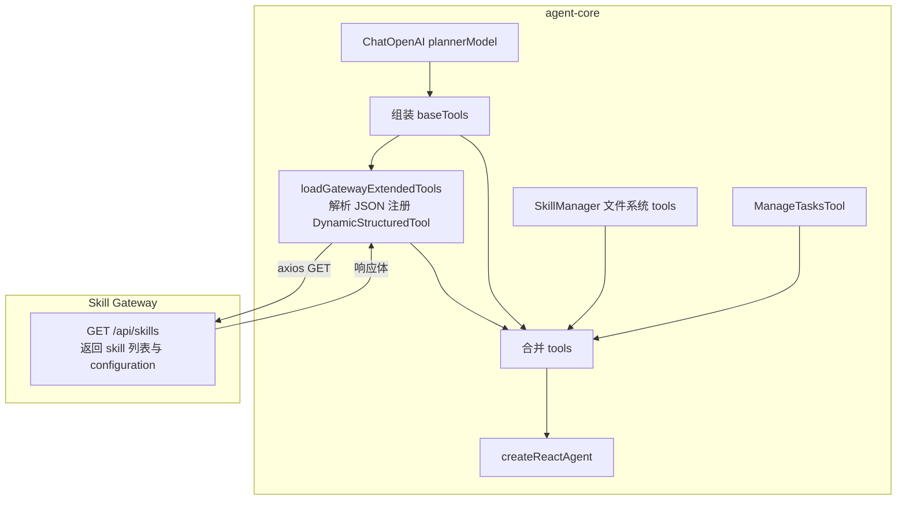
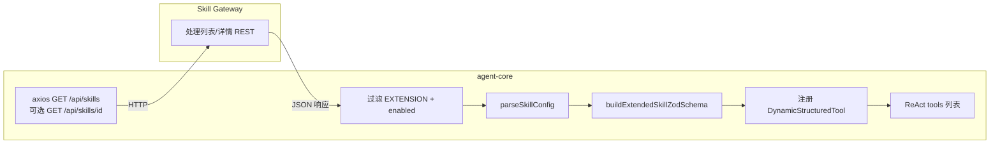
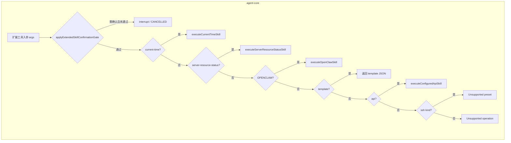
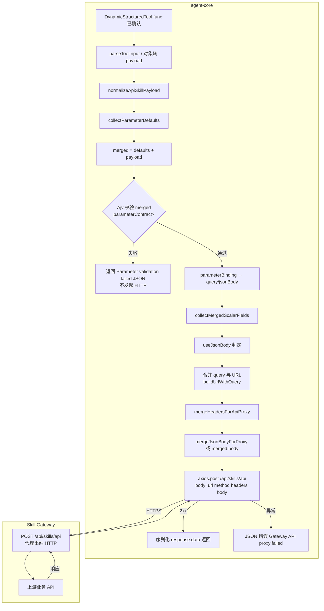
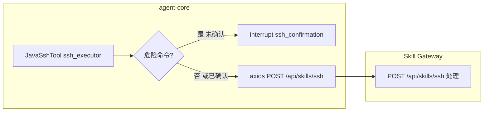
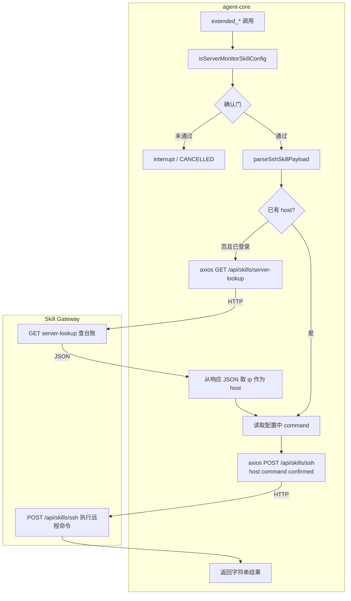
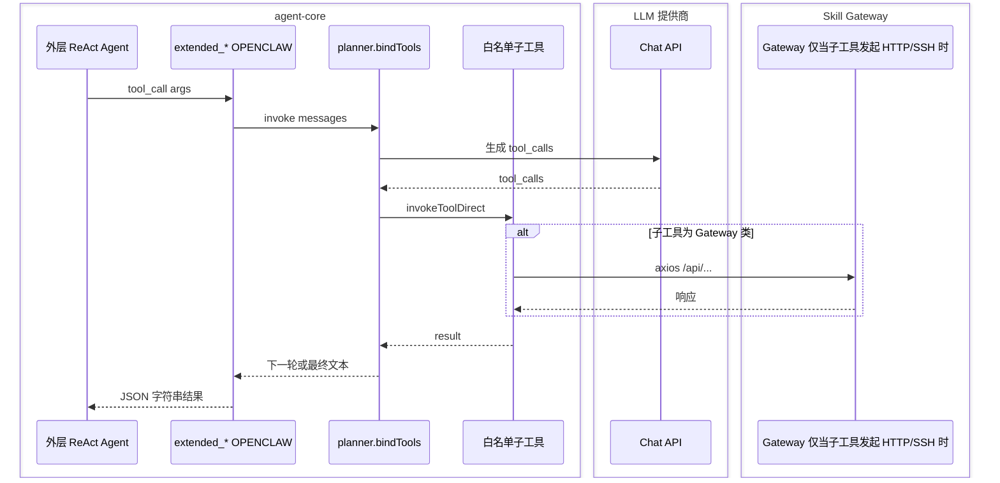
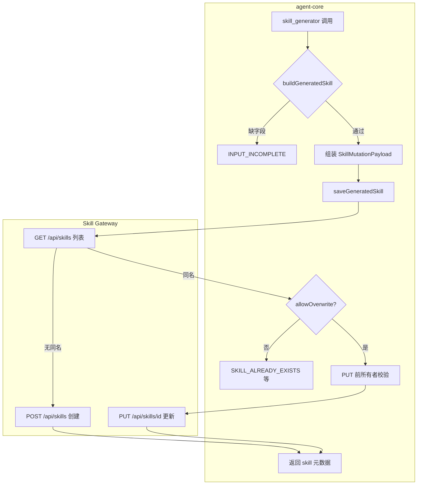
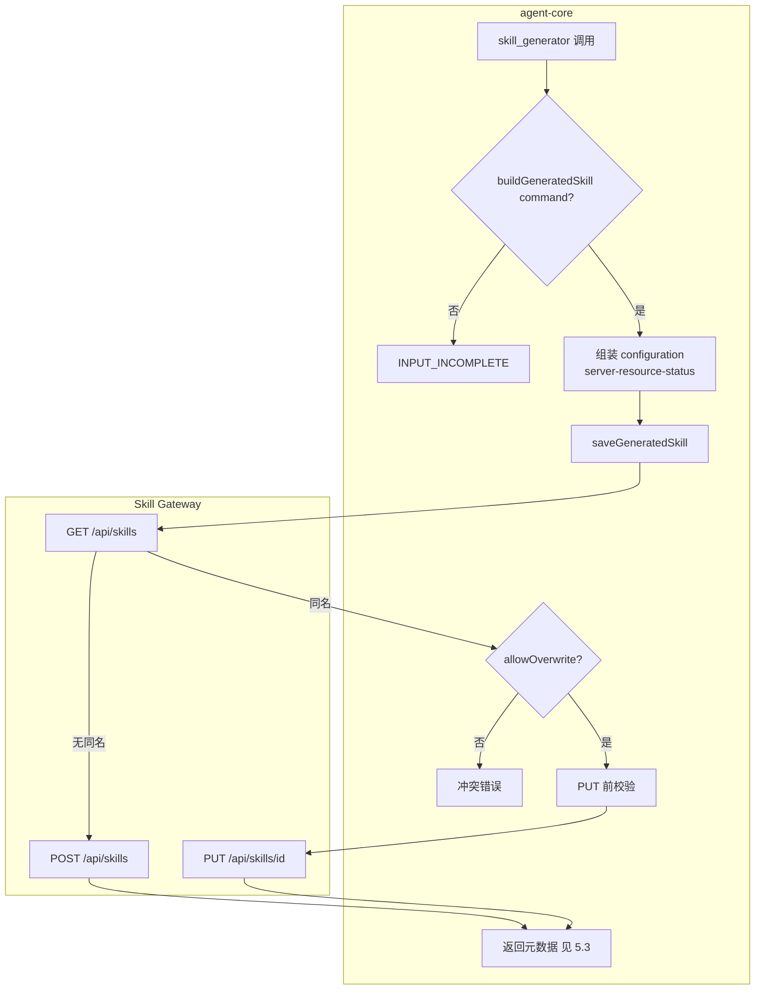

# Agent 任务执行中的 Skill 逻辑与数据流

## 系统内置 Built-in 与扩展表分离（概要）

- **扩展 Skill** 仍存于 **`skills` 表**，经 **`GET /api/skills`** 加载并在 agent 侧注册为 `DynamicStructuredTool`（`EXTENSION` 等类型）。
- **平台内置** `api_caller`、`compute`、`ssh_executor` 的定义在 Gateway **`system_skills` 表**（与用户扩展 **分表**），发现接口：**`GET /api/system-skills/agent`**；统一执行：**`POST /api/system-skills/execute`**（body：`toolName` + `arguments`），内部复用与 `/api/skills/api`、`/compute`、`/ssh` 相同的 Java 逻辑（见 `BuiltinToolExecutionService`）。
- **agent-core** 环境变量 **`AGENT_BUILTIN_SKILL_DISPATCH`**：`legacy`（默认）直连旧路径；`gateway` 对上述三内置改为只调 `/api/system-skills/execute`。**`skill_generator`、linux_script、server_lookup 等本阶段仍走原逻辑**，不受该开关约束（与 OpenSpec `unified-skill-db-agent-thin` 一致）。

---

本文说明 **agent-core** 在单次对话任务中如何装配工具、如何从 Skill Gateway 加载 **EXTENSION** skill，以及内置 **`skill_generator`**、扩展 **API / SSH / template / OPENCLAW** 等路径上的数据如何流动。叙述以当前实现为准，主要代码位于：

| 模块 | 路径 |
|------|------|
| Agent 与工具列表 | `backend/agent-core/src/agent/agent.ts` |
| 内置工具、扩展加载、OPENCLAW、API 代理、SSH | `backend/agent-core/src/tools/java-skills.ts` |
| 扩展 Skill 路由提示（影响模型选型，非独立代码分支） | `backend/agent-core/src/controller/agent.controller.ts`（`AGENT_EXTENDED_SKILL_ROUTING_POLICY`） |

### 图例（流程图中的职责边界）

下文 Mermaid 图中统一使用 **subgraph** 标注运行时边界：

| 区域 | 含义 |
|------|------|
| **agent-core** | Node.js 进程：`backend/agent-core`，含 LangGraph ReAct、工具函数、`axios` 客户端发起到 Gateway 的请求。 |
| **Skill Gateway** | Java 服务：持久化 skill、**代理出站 HTTP**（`/api/skills/api`）、**执行 SSH**（`/api/skills/ssh`）、台账 **`/api/skills/server-lookup`** 等。具体出站策略以 Gateway 实现为准。 |
| **LLM 提供商** | 对话模型 API（OpenAI 兼容）；仅在外层 Agent / OPENCLAW 子 planner 调用时出现。 |

---

## 1. 工具如何进入 ReAct Agent

`AgentFactory.createAgent` 依次：

1. 构造 `ChatOpenAI`（`plannerModel`），供主对话与 OPENCLAW 子 planner 复用。
2. 根据是否暴露内置 SSH，组装 **`baseTools`**。
3. 调用 **`loadGatewayExtendedTools`**：由 **agent-core** 发 **`GET /api/skills`** 到 **Skill Gateway**，再本地构建 `DynamicStructuredTool`。
4. 最终 `tools = baseTools + gatewayExtendedTools + skillManager 文件系统工具 + ManageTasksTool`。

### 1.1 `baseTools` 组成与 `ssh_executor` 可见性

默认 **`baseTools`** 包含（顺序与实现一致）：

- 条件项：**`JavaSshTool`（`ssh_executor`）** — 仅当 **未传 `userId`**，或环境变量 **`AGENT_EXPOSE_SSH_EXECUTOR`** 为 `1` / `true` 时加入。
- **`JavaApiTool`（`api_caller`）**
- **`JavaSkillGeneratorTool`（`skill_generator`）**
- **`JavaComputeTool`（`compute`）**
- **`JavaLinuxScriptTool`（`linux_script_executor`）**
- **`JavaServerLookupTool`（`server_lookup`）**

已登录且未显式暴露时，模型侧更依赖 **扩展 SSH / server_lookup** 等扩展工具，与 controller 中的扩展路由策略一致。

---

## 2. 扩展 Skill 的加载与命名

`loadGatewayExtendedTools`（**agent-core**）：

1. **`GET /api/skills`**（→ **Skill Gateway**；头：`X-Agent-Token`，可选 `X-User-Id`）列出 skill。
2. 过滤 **`type === EXTENSION`** 且 **`enabled`**（在 agent-core 内存中过滤）。
3. 对每个 skill：解析 `configuration`，必要时 **`GET /api/skills/{id}`**（→ Gateway）补全；按 skill 名称生成 **工具名**（`normalizeToolName` → 通常前缀 **`extended_`**）。
4. 根据配置构建 **Zod schema**（`buildExtendedSkillZodSchema`），注册 **`DynamicStructuredTool`**（对象留在 agent-core 进程）。

---

## 3. 单次扩展 Skill 调用：`func` 内分支（数据流）

外层 Agent 发起 **structured tool call** 后，进入 **agent-core** 内 `DynamicStructuredTool` 的 `func`，大致顺序为：

1. **确认门**：若 skill 配置需要确认，则通过 `applyExtendedSkillConfirmationGate` 与 LangGraph **interrupt** 交互；用户确认后带 **`confirmed: true`** 重入（见 `buildConfirmedToolArgs` / `invokeExtendedSkillWithConfirmed`）。
2. **特殊 CONFIG**：`current-time` → 见 `executeCurrentTimeSkill`（仍经 Gateway `/api/skills/api` 代理）；**`server-resource-status`** → 第 5 节。
3. **`executionMode === OPENCLAW` 或 `kind === openclaw`** → **`executeOpenClawSkill`**（第 6 节）。
4. **`kind === template`** → 返回 JSON，提示主 Agent 将 `prompt` 与 `userInput` 合并后**仅用自然语言回复**，不再重复调用该工具。
5. **API 类**：`kind === api` 或特定 `operation` → **`executeConfiguredApiSkill`**（第 4 节）。
6. **`kind === ssh`**：若**不是** `server-resource-status` 等已识别预设，当前实现返回 **不支持 preset** 错误（扩展 SSH 的可用形态以代码分支为准）。

---

## 4. 扩展 API Skill：`executeConfiguredApiSkill`

实现位置：**agent-core** `executeConfiguredApiSkill`。出站 HTTP 由 **Skill Gateway** `/api/skills/api` 代理；agent-core **不**直接请求业务 URL。

### 4.1 参数归一、校验与拼接（均在 agent-core）

以下步骤与 `java-skills.ts` 中实现一一对应：

1. **解析入参 `input`**：若为字符串则 `parseToolInput`（JSON）；若为对象则浅拷贝为 `payload`。
2. **`normalizeApiSkillPayload`**：若存在字符串字段 **`input`** 且内容为 JSON 对象，则展开并与顶层字段合并（兼容旧式「整包塞进 `input`」的调用）。
3. **`collectParameterDefaults(parameterContract)`**：从 JSON Schema 的 `properties.*.default`（或网关扁平结构中的 `default`）收集标量默认值。
4. **合并**：`merged = { ...defaults, ...payload }`（调用方覆盖默认）。
5. **JSON Schema 校验**：若配置了 `parameterContract`（`type: object` 且含 `properties`），使用 **Ajv** `compile` + `validate(merged)`。失败则 **在 agent-core 内**返回 JSON 字符串，包含 `error`、`details`、`expectedContract`、`interfaceDescription`（若有）、`hint`，**不发起 HTTP**。
6. **`parameterBinding`**：`normalizeParameterBindingValue` 后为 **`query`** 或 **`jsonBody`**；缺省为 **`query`**。
7. **`flatScalars`**：`collectMergedScalarFields(merged)` — 排除保留键 `query` / `headers` / `body`，只收集标量，用于 jsonBody 合并。
8. **`useJsonBody`**：`binding === "jsonBody"` **且** `isMethodAllowingJsonBodyBinding(method)`（GET/HEAD 不允许把标量绑到 body）。
9. **Query 合并**：`query = toQueryRecord(config.query) + toQueryRecord(merged.query)`；若 **非** `useJsonBody`，将 `merged` 中除保留键外的**标量**再并入 `query`（用于拼到 URL）。
10. **最终 URL**：`endpoint = buildUrlWithQuery(config.endpoint, query)`（`URL` + `searchParams`）；若为空返回错误。
11. **请求头**：`mergeHeadersForApiProxy(config.headers, method, useJsonBody)` — 在 jsonBody 且 POST/PUT/PATCH/DELETE 时若缺省则补 **`Content-Type: application/json`**。
12. **请求体**：若 `useJsonBody` 则 `mergeJsonBodyForProxy(merged, flatScalars)`（标量 + `merged.body` 解析）；否则为 `merged.body ?? ""`。

### 4.2 调用 Gateway 与错误（agent-core → Skill Gateway → 上游）

- **agent-core**：`axios.post(\`${gatewayUrl}/api/skills/api\`, { url: endpoint, method, headers: headersOut, body: requestBody }, { headers: { X-Agent-Token, Content-Type } })`。
- **Skill Gateway**：接收代理请求，对 **`url`** 发起出站 HTTP；具体超时、重试、TLS 等以 Gateway 为准。
- **agent-core**：成功则将 `response.data` 转为字符串返回；Axios 错误则返回 JSON，含 `Gateway API proxy request failed`、`status`、`details`、`hint`（**错误文案在 agent-core 组装**，内容可能来自 Gateway 响应体）。

### 4.3 运行时：扩展 API 类 skill 全流程（含职责）

---

## 5. SSH：内置 `ssh_executor` 与扩展 `server-resource-status`

### 5.1 内置 `ssh_executor`（`JavaSshTool`）

- **agent-core**：危险命令 **`interrupt`**（`ssh_confirmation`），确认后 **`axios.post(\`${gatewayUrl}/api/skills/ssh\`, args, { X-Agent-Token, X-User-Id? })`**。
- **Skill Gateway**：执行 SSH 会话并返回结果。

### 5.2 扩展：SSH preset `server-resource-status`

- **agent-core**：`executeServerResourceStatusSkill` 解析 `name` / host；可选 **`axios.get` `/api/skills/server-lookup`**（→ Gateway）；再 **`POST /api/skills/ssh`**。
- **Skill Gateway**：台账解析、SSH 执行。

### 5.3 运行时：由 `skill_generator` 生成的 SSH 类扩展 skill（`server-resource-status`）

生成器写入 **`preset: server-resource-status`**，运行时走 **`executeServerResourceStatusSkill`**。

---

## 6. OPENCLAW（自主规划类扩展 Skill）

`executeOpenClawSkill`（**agent-core**）：

1. 校验 **`orchestration.mode`**（当前仅 **`serial`**）。
2. **`allowedTools`** 解析为 **`baseTools` 中的子集**（**agent-core** 内工具对象）。
3. **`plannerModel.bindTools(allowedTools)`** → 调用 **LLM 提供商** API；子轮次 **`invokeToolDirect`** 可能再次命中 **仅 agent-core** 的工具函数，或间接调用 **Gateway**（例如子工具为 `extended_*` API skill 时）。

要点：OPENCLAW **不是** Gateway 上的独立规划服务；子工具若访问 Gateway，仍按各工具实现（见第 4、5 节）。

---

## 7. 内置 `skill_generator`（`JavaSkillGeneratorTool`）

- **agent-core**：`buildGeneratedSkill`、`saveGeneratedSkill`（内部 `axios`）。
- **Skill Gateway**：`GET /api/skills`、`POST /api/skills`、`PUT /api/skills/{id}` 持久化。

### 7.1 生成流程：API 类 skill（`targetType: api`）

`buildGeneratedSkill` 校验 **`endpoint`**（合法 URL）、**`method`**、**`interfaceDescription`**、**`parameterContract`**；组装 **`configuration`**；**POST/PUT/PATCH/DELETE** 默认 **`parameterBinding: jsonBody`**。

### 7.2 生成流程：SSH 类 skill（`targetType: ssh`）

`buildGeneratedSkill` 要求 **`command`**；**`configuration`** 含 **`preset: server-resource-status`** 等；持久化与 7.1 相同。

---

## 8. Gateway 认证头小结

| 头 | 谁设置 | 用途 |
|----|--------|------|
| `X-Agent-Token` | agent-core 的 `axios` 请求 | Agent 与 Gateway 之间的 API token |
| `X-User-Id` | agent-core（有登录用户时） | 列表/详情过滤、台账解析、扩展 skill 归属等 |

---

## 9. 相关 OpenSpec 能力（行为权威）

产品层行为以 `openspec/specs/` 为准，例如：`built-in-skill-generation`、`api-skill-invocation`、`ssh-skill`、`openclaw-skill-orchestration`、`agent-extended-skill-priority` 等。本文仅描述 **agent-core 当前实现路径**，若与规格冲突，应优先以代码与规格变更流程为准。
